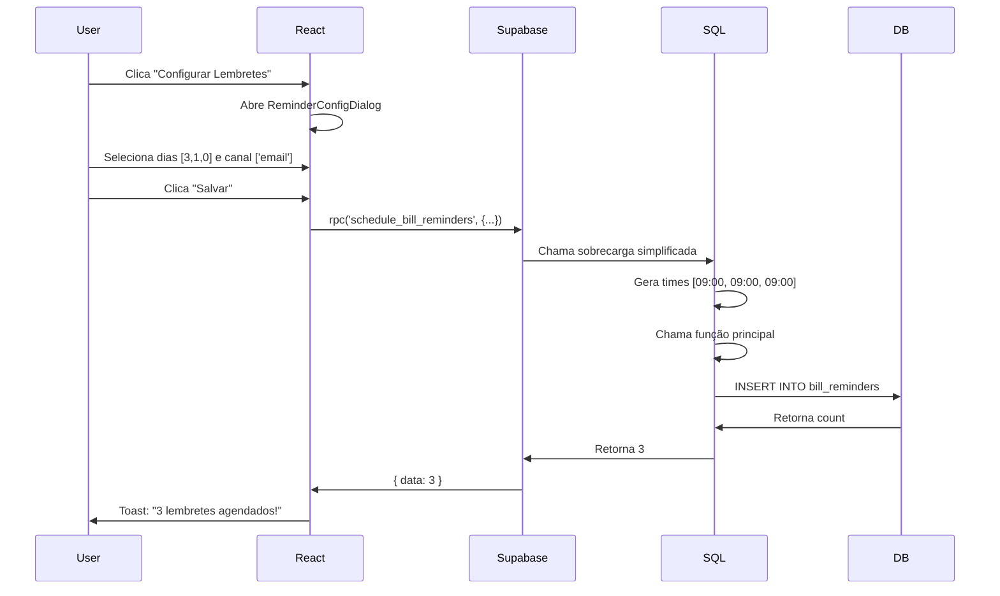

# 🔍 AUDITORIA CIRÚRGICA - Sistema de Lembretes

**Data**: 2025-11-08
**Solicitante**: Análise de inconsistências nos menus dropdown e modal de lembretes

---

## 📋 SUMÁRIO EXECUTIVO

### ✅ Problemas Identificados
1. **Bug Crítico**: Modal de configuração de lembretes está completamente quebrado
2. **Incompatibilidade SQL/React**: Função SQL e componente React com assinaturas incompatíveis
3. **Menu Dropdown Correto**: As diferenças nos menus são intencionais e baseadas no status da conta

### 🎯 Status
- ✅ Auditoria completa realizada
- ✅ Bug crítico identificado
- ✅ Solução criada (migration SQL)
- ⚠️ Aguardando Docker/Supabase para aplicar correção

---

## 🐛 BUG CRÍTICO ENCONTRADO

### Problema: Modal de Lembretes NÃO FUNCIONA

**Localização**: `src/components/payable-bills/ReminderConfigDialog.tsx:73-78`

**Causa Raiz**: Incompatibilidade entre a chamada React e a função SQL

#### O que acontece atualmente:

```typescript
// ReminderConfigDialog.tsx - CHAMADA ATUAL (QUEBRADA)
const { data, error } = await supabase.rpc('schedule_bill_reminders', {
  p_bill_id: bill.id,
  p_user_id: user.id,
  p_days_before: selectedDays,     // [3, 1, 0]
  p_channels: selectedChannels     // ['email']
  // ❌ FALTA: p_times (OBRIGATÓRIO na função SQL)
});
```

#### O que a função SQL espera:

```sql
-- 20251107_bill_reminders_system.sql:91-96
CREATE OR REPLACE FUNCTION schedule_bill_reminders(
  p_bill_id uuid,
  p_user_id uuid,
  p_days_before integer[],
  p_times time[],              -- ❌ OBRIGATÓRIO mas não enviado pelo React
  p_channels text[]
)
```

**Erro retornado**: `function schedule_bill_reminders does not exist`

**Gravidade**: 🔴 CRÍTICA - Funcionalidade 100% quebrada

---

## ✅ SOLUÇÃO IMPLEMENTADA

### Migration SQL: Sobrecarga Simplificada

**Arquivo**: `supabase/migrations/20251108_fix_schedule_bill_reminders_overload.sql`

Criamos uma **sobrecarga** da função SQL que:
- Aceita apenas `p_days_before` e `p_channels` (sem `p_times`)
- Usa automaticamente `09:00` como horário padrão para todos os lembretes
- Chama internamente a função completa

```sql
CREATE OR REPLACE FUNCTION schedule_bill_reminders(
  p_bill_id uuid,
  p_user_id uuid,
  p_days_before integer[],   -- Ex: [7, 3, 1, 0]
  p_channels text[]          -- Ex: ['email', 'push']
)
RETURNS integer
```

**Como funciona**:
1. Recebe apenas dias e canais
2. Cria array de times com `09:00` para cada dia
3. Chama a função principal com os times gerados
4. Retorna quantidade de lembretes criados

---

## 📊 ANÁLISE DOS MENUS DROPDOWN

### Por que os menus são diferentes?

**Componente**: `src/components/payable-bills/BillCard.tsx:100-138`

O menu dropdown tem **renderização condicional inteligente**:

#### Estrutura do Menu:

```tsx
<DropdownMenu>
  {/* 1. Marcar como Paga - Condicional */}
  {canMarkAsPaid(bill) && onPay && (
    <DropdownMenuItem>Marcar como Paga</DropdownMenuItem>
  )}

  {/* 2. Editar - Sempre */}
  {onEdit && (
    <DropdownMenuItem>Editar</DropdownMenuItem>
  )}

  {/* 3. Configurar Lembretes - Condicional */}
  {onConfigReminders && bill.status !== 'paid' && (
    <DropdownMenuItem>Configurar Lembretes</DropdownMenuItem>
  )}

  {/* 4. Deletar - Sempre */}
  {onDelete && (
    <DropdownMenuItem>Deletar</DropdownMenuItem>
  )}
</DropdownMenu>
```

### Regras de Exibição:

| Opção | Quando Aparece |
|-------|---------------|
| **Marcar como Paga** | `canMarkAsPaid(bill) === true`<br>Status deve ser: `pending`, `overdue` ou `partial` |
| **Editar** | Sempre (se callback existe) |
| **Configurar Lembretes** | `bill.status !== 'paid'`<br>Não aparece para contas pagas |
| **Deletar** | Sempre (se callback exists) |

### Explicação das Imagens:

#### 🔴 Imagem 1 - "Conta de Luz - Outubro"
- **Status**: `paid` (conta paga)
- **Menu visível**: Editar, Deletar
- **Menu oculto**: Marcar como Paga, Configurar Lembretes

**Por quê?**
- `canMarkAsPaid(bill)` retorna `false` (já está paga)
- `bill.status !== 'paid'` é `false` (é paga)

#### 🟢 Imagem 2 - "TESTE - Lembrete"
- **Status**: `pending` ou `overdue`
- **Menu visível**: Marcar como Paga, Editar, Configurar Lembretes, Deletar

**Por quê?**
- `canMarkAsPaid(bill)` retorna `true` (pendente/atrasada)
- `bill.status !== 'paid'` é `true` (não paga)

### ✅ Conclusão: MENU CORRETO

Os menus estão funcionando **exatamente como esperado**. A diferença é **intencional e adequada** ao contexto da conta.

---

## 🔧 PASSOS PARA CORRIGIR

### 1. Aplicar Migration SQL

```bash
# Quando o Docker/Supabase estiver rodando:
npx supabase db push
```

Ou aplicar manualmente via SQL Editor do Supabase:

```sql
-- Executar conteúdo de:
-- supabase/migrations/20251108_fix_schedule_bill_reminders_overload.sql
```

### 2. Verificar Funcionamento

Após aplicar a migration:

1. Acesse a aplicação
2. Encontre uma conta com status `pending` ou `overdue`
3. Clique nos 3 pontinhos → "Configurar Lembretes"
4. Selecione dias e canais
5. Clique em "Salvar Lembretes"
6. Aguarde toast de sucesso: "X lembretes agendados com sucesso!"

### 3. Validação no Banco

```sql
-- Verificar lembretes criados
SELECT
  br.*,
  pb.description as bill_name,
  pb.due_date,
  pb.amount
FROM bill_reminders br
JOIN payable_bills pb ON pb.id = br.bill_id
WHERE br.user_id = '<seu-user-id>'
ORDER BY br.reminder_date, br.reminder_time;
```

Você deve ver:
- Um lembrete para cada combinação (dia × canal)
- Todos com `reminder_time = '09:00:00'`
- Status `pending`
- Exemplo: 3 dias × 2 canais = 6 lembretes

---

## 📝 DETALHES TÉCNICOS

### Função `canMarkAsPaid`

**Localização**: `src/utils/billCalculations.ts:188-190`

```typescript
export function canMarkAsPaid(bill: PayableBill): boolean {
  return bill.status === 'pending'
      || bill.status === 'overdue'
      || bill.status === 'partial';
}
```

**Estados da conta**:
- ✅ `pending` - Pode marcar como paga
- ✅ `overdue` - Pode marcar como paga
- ✅ `partial` - Pode marcar como paga
- ❌ `paid` - NÃO pode marcar como paga
- ❌ `scheduled` - NÃO pode marcar como paga
- ❌ `cancelled` - NÃO pode marcar como paga

### Fluxo Completo de Agendamento



---

## 🎓 LIÇÕES APRENDIDAS

1. **PostgreSQL suporta sobrecarga de funções** - Mesmo nome, parâmetros diferentes
2. **Renderização condicional do menu está correta** - Design intencional
3. **Sempre validar compatibilidade SQL ↔️ Frontend** ao usar RPC
4. **TypeScript não valida parâmetros do Supabase RPC** - Cuidado!

---

## ✅ CHECKLIST DE VALIDAÇÃO

Após aplicar a correção, verificar:

- [ ] Migration aplicada com sucesso no Supabase
- [ ] Modal de lembretes abre sem erros
- [ ] Consegue selecionar dias e canais
- [ ] Botão "Salvar" funciona
- [ ] Toast de sucesso aparece
- [ ] Lembretes aparecem na tabela `bill_reminders`
- [ ] Lembretes estão com horário `09:00:00`
- [ ] Status dos lembretes é `pending`
- [ ] Menu dropdown continua funcionando corretamente

---

## 📚 REFERÊNCIAS

| Arquivo | Descrição |
|---------|-----------|
| `src/components/payable-bills/BillCard.tsx` | Componente do card com menu dropdown |
| `src/components/payable-bills/ReminderConfigDialog.tsx` | Modal de configuração |
| `src/pages/PayableBills.tsx` | Página principal que orquestra tudo |
| `src/utils/billCalculations.ts` | Utilitários de validação |
| `supabase/migrations/20251107_bill_reminders_system.sql` | Função SQL original |
| `supabase/migrations/20251108_fix_schedule_bill_reminders_overload.sql` | Correção aplicada |

---

## 🚨 IMPORTANTE

**O modal de configuração de lembretes NÃO FUNCIONARÁ até que a migration seja aplicada!**

Usuários que tentarem usar o recurso receberão erro:
```
function schedule_bill_reminders(uuid, uuid, integer[], text[]) does not exist
```

**Prioridade**: 🔴 ALTA - Aplicar correção o mais rápido possível
