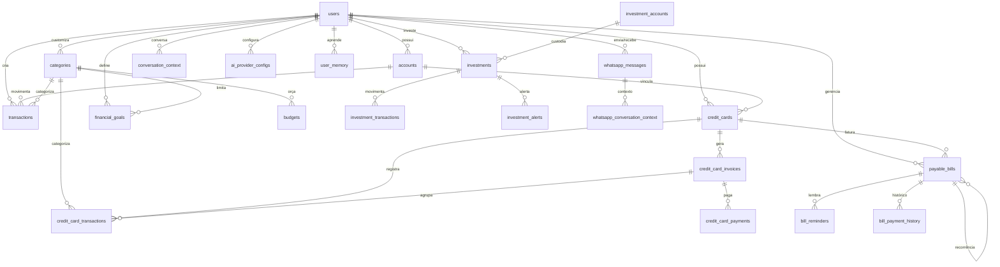

# 📋 AUDITORIA COMPLETA - PARTE 1: BANCO DE DADOS
## Personal Finance LA - 16/12/2025

---

## 📊 RESUMO EXECUTIVO

| Métrica | Valor |
|---------|-------|
| **Total de Tabelas** | 58 |
| **Total de Views** | 14 |
| **Total de Functions** | 78 |
| **Total de Triggers** | 72 |
| **Total de RLS Policies** | 130+ |
| **Foreign Keys** | 47 |
| **Tabelas Órfãs** | 4 |
| **Tabelas Hub** | users (8), categories (7), accounts (7) |

---

## 1. LISTA DE TODAS AS TABELAS (58 tabelas)

### Core (7 tabelas)
- `users` (13 cols) - Usuários do sistema
- `accounts` (13 cols) - Contas bancárias
- `categories` (10 cols) - Categorias de transação
- `category_rules` (6 cols) - Regras de categorização automática
- `tags` (6 cols) - Tags para transações
- `financial_cycles` (15 cols) - Ciclos financeiros
- `saved_filters` (6 cols) - Filtros salvos

### Transações (4 tabelas)
- `transactions` (23 cols) - Transações bancárias
- `transaction_tags` (4 cols) - Tags de transações
- `transaction_edits` (9 cols) - Histórico de edições

### Cartões de Crédito (6 tabelas)
- `credit_cards` (18 cols) - Cartões de crédito
- `credit_card_invoices` (15 cols) - Faturas
- `credit_card_transactions` (20 cols) - Transações de cartão
- `credit_card_payments` (10 cols) - Pagamentos de fatura
- `credit_card_transaction_tags` (4 cols) - Tags de transações

### Contas a Pagar (4 tabelas)
- `payable_bills` (38 cols) - Contas a pagar
- `bill_payment_history` (11 cols) - Histórico de pagamentos
- `bill_reminders` (15 cols) - Lembretes
- `bill_tags` (3 cols) - Tags de contas

### Metas (5 tabelas)
- `financial_goals` (17 cols) - Metas unificadas
- `savings_goals` (21 cols) - Metas de economia (legado)
- `goal_contributions` (8 cols) - Contribuições
- `financial_goal_contributions` (6 cols) - Contribuições novas

### Investimentos (9 tabelas)
- `investments` (23 cols) - Investimentos
- `investment_accounts` (10 cols) - Corretoras
- `investment_transactions` (12 cols) - Movimentações
- `investment_alerts` (12 cols) - Alertas de preço
- `investment_goals` (23 cols) - Metas de investimento
- `investment_goal_contributions` (8 cols) - Contribuições
- `investment_allocation_targets` (6 cols) - Alocação alvo
- `investment_quotes_history` (8 cols) - Histórico de cotações
- `market_opportunities` (16 cols) - Oportunidades de mercado
- `portfolio_snapshots` (12 cols) - Snapshots do portfólio

### Orçamento (2 tabelas)
- `budgets` (8 cols) - Orçamentos por categoria
- `budget_summaries` (8 cols) - Resumos de orçamento

### Gamificação (6 tabelas)
- `badges` (8 cols) - Badges disponíveis
- `user_badges` (5 cols) - Badges do usuário
- `badge_progress` (11 cols) - Progresso
- `challenges` (13 cols) - Desafios
- `user_achievements` (11 cols) - Conquistas
- `user_gamification` (13 cols) - Gamificação geral
- `user_gamification_profile` (13 cols) - Perfil de gamificação

### WhatsApp/NLP (7 tabelas)
- `whatsapp_messages` (21 cols) - Mensagens
- `whatsapp_connection_status` (15 cols) - Status de conexão
- `whatsapp_connections` (19 cols) - Conexões UAZAPI
- `whatsapp_conversation_context` (12 cols) - Contexto de conversa
- `whatsapp_quick_commands` (13 cols) - Comandos rápidos
- `conversation_context` (9 cols) - Contexto alternativo
- `user_memory` (11 cols) - Memória da Ana Clara

### Configurações (4 tabelas)
- `user_settings` (17 cols) - Configurações do usuário
- `ai_provider_configs` (19 cols) - Configuração de IA
- `notification_preferences` (50 cols) - Preferências de notificação
- `ana_insights_cache` (6 cols) - Cache de insights

### Integrações (4 tabelas)
- `integration_configs` (21 cols) - Configurações de integração
- `webhook_endpoints` (22 cols) - Endpoints de webhook
- `webhook_logs` (17 cols) - Logs de webhook
- `push_tokens` (7 cols) - Tokens de push notification
- `notifications_log` (8 cols) - Log de notificações

---

## 2. FOREIGN KEYS (47 relacionamentos)

### Tabelas HUB (mais referenciadas)
| Tabela | Referências | Papel |
|--------|-------------|-------|
| `users` | 8 | Raiz do sistema |
| `categories` | 7 | Categorização universal |
| `accounts` | 7 | Contas bancárias |
| `payable_bills` | 5 | Contas a pagar (self-ref) |
| `credit_cards` | 3 | Cartões de crédito |
| `tags` | 3 | Sistema de tags |

### Mapa Completo de FKs
```
accounts.user_id → users.id
bill_payment_history.bill_id → payable_bills.id
bill_payment_history.account_from_id → accounts.id
bill_reminders.bill_id → payable_bills.id
bill_tags.bill_id → payable_bills.id
bill_tags.tag_id → tags.id
budgets.category_id → categories.id
categories.parent_id → categories.id (self-ref)
categories.user_id → users.id
category_rules.category_id → categories.id
conversation_context.user_id → users.id
credit_card_invoices.credit_card_id → credit_cards.id
credit_card_invoices.payment_account_id → accounts.id
credit_card_payments.invoice_id → credit_card_invoices.id
credit_card_payments.account_id → accounts.id
credit_card_transaction_tags.credit_card_transaction_id → credit_card_transactions.id
credit_card_transaction_tags.tag_id → tags.id
credit_card_transactions.credit_card_id → credit_cards.id
credit_card_transactions.invoice_id → credit_card_invoices.id
credit_card_transactions.category_id → categories.id
credit_cards.account_id → accounts.id
financial_goal_contributions.goal_id → financial_goals.id
financial_goals.category_id → categories.id
goal_contributions.goal_id → savings_goals.id
investment_alerts.investment_id → investments.id
investment_goal_contributions.goal_id → investment_goals.id
investment_transactions.investment_id → investments.id
investments.account_id → investment_accounts.id
payable_bills.parent_bill_id → payable_bills.id (self-ref)
payable_bills.parent_recurring_id → payable_bills.id (self-ref)
payable_bills.credit_card_id → credit_cards.id
payable_bills.category_id → categories.id
payable_bills.payment_account_id → accounts.id
push_tokens.user_id → users.id
transaction_edits.user_id → users.id
transaction_edits.transaction_id → transactions.id
transaction_tags.transaction_id → transactions.id
transaction_tags.tag_id → tags.id
transactions.account_id → accounts.id
transactions.user_id → users.id
transactions.category_id → categories.id
transactions.transfer_to_account_id → accounts.id
user_badges.badge_id → badges.id
user_memory.user_id → users.id
users.partner_id → users.id (self-ref)
webhook_logs.webhook_id → webhook_endpoints.id
whatsapp_conversation_context.last_message_id → whatsapp_messages.id
```

---

## 3. TRIGGERS (72 triggers)

### Triggers por Tabela (ordenado por quantidade)

| Tabela | Qtd | Triggers |
|--------|-----|----------|
| `credit_card_transactions` | 10 | ⚠️ CRÍTICO |
| `credit_card_invoices` | 6 | update_available_limit, calculate_invoice_total |
| `investments` | 4 | calculate_returns, check_badges |
| `transactions` | 4 | update_account_balance |
| `investment_transactions` | 2 | update_investment_after_transaction |
| `budgets` | 3 | update_budget_summary |
| `goal_contributions` | 2 | update_goal_amount |
| `investment_allocation_targets` | 2 | check_allocation_total |
| `investment_goal_contributions` | 2 | update_investment_goal_amount |
| Demais tabelas | 1 cada | update_updated_at |

### ⚠️ TRIGGERS EM credit_card_transactions (PONTO CRÍTICO)
1. `trigger_auto_categorize` (BEFORE INSERT)
2. `trigger_auto_categorize` (BEFORE UPDATE)
3. `trigger_apply_category_rules` (BEFORE INSERT)
4. `trg_update_card_limit_on_purchase` (AFTER INSERT)
5. `trg_update_card_limit_on_delete` (AFTER DELETE)
6. `trg_update_invoice_total_on_transaction` (AFTER INSERT)
7. `trg_update_invoice_total_on_delete` (AFTER DELETE)
8. `trigger_update_invoice_total` (AFTER INSERT/UPDATE/DELETE)
9. `trg_update_spending_goals` (AFTER INSERT/UPDATE/DELETE)
10. `update_cc_transactions_updated_at` (BEFORE UPDATE)

**PROBLEMA:** Múltiplos triggers AFTER INSERT podem causar conflitos.

---

## 4. FUNCTIONS (78 funções)

### Por Categoria

| Categoria | Qtd | Exemplos |
|-----------|-----|----------|
| Triggers | 32 | update_updated_at_column, update_account_balance |
| Contas a Pagar | 8 | auto_generate_recurring_bills, mark_bill_as_paid |
| Investimentos | 7 | calculate_portfolio_metrics, sync_investment_prices |
| Gamificação | 8 | add_xp_to_user, check_and_unlock_badges |
| WhatsApp/NLP | 4 | process_whatsapp_command, send_proactive_whatsapp_notifications |
| Cartões | 6 | update_invoice_total, calculate_invoice_total_on_close |
| Metas | 4 | calculate_spending_streak, update_spending_goals |
| Utilitárias | 5 | now_brasilia, current_date_brasilia |
| Memória IA | 2 | adicionar_memoria_usuario, incrementar_frequencia_memoria |

### Funções Críticas para NLP
- `process_whatsapp_command` - Processa comandos rápidos
- `send_proactive_whatsapp_notifications` - Lembretes proativos
- `adicionar_memoria_usuario` - Memória de contexto
- `incrementar_frequencia_memoria` - Aprendizado
- `cleanup_expired_conversation_contexts` - Limpeza de contexto

---

## 5. RLS POLICIES (130+ policies)

### Cobertura

| Status | Tabelas |
|--------|---------|
| ✅ CRUD Completo | accounts, transactions, categories, credit_cards, payable_bills, investments |
| ✅ SELECT/INSERT/UPDATE | bill_reminders, user_settings, notification_preferences |
| ⚠️ Apenas SELECT | badges (público), whatsapp_quick_commands (is_active=true) |
| ⚠️ ALL com true | ana_insights_cache, webhook_logs (service role) |

### Policies Problemáticas
1. `ana_insights_cache` - "Service role can manage cache" com `qual = true`
2. `webhook_logs` - "Service role can update" com `qual = true`
3. `user_memory` - Permite `user_id IS NULL`

---

## 6. TABELAS WHATSAPP/NLP (Estrutura Detalhada)

### 6.1 whatsapp_messages (21 colunas)
| Coluna | Tipo | Descrição |
|--------|------|-----------|
| id | UUID | PK |
| user_id | UUID | FK → users |
| whatsapp_message_id | TEXT | ID do WhatsApp |
| phone_number | VARCHAR | Telefone |
| message_type | ENUM | text/audio/image/document/video/location/contact |
| direction | ENUM | inbound/outbound |
| content | TEXT | Conteúdo da mensagem |
| media_url | TEXT | URL da mídia |
| intent | ENUM | Intenção detectada |
| processing_status | ENUM | pending/processing/completed/failed/cancelled |
| extracted_data | JSONB | Dados extraídos pelo NLP |
| response_text | TEXT | Resposta enviada |
| error_message | TEXT | Erro se houver |
| retry_count | INTEGER | Tentativas |

### 6.2 conversation_context (9 colunas) - CONTEXTO PRINCIPAL
| Coluna | Tipo | Descrição |
|--------|------|-----------|
| id | UUID | PK |
| user_id | UUID | FK → users |
| phone | VARCHAR | Telefone |
| context_type | ENUM | 27 valores! |
| context_data | JSONB | Dados do contexto |
| expires_at | TIMESTAMPTZ | TTL 5 minutos |

### 6.3 whatsapp_conversation_context (12 colunas) - CONTEXTO ALTERNATIVO
| Coluna | Tipo | Descrição |
|--------|------|-----------|
| id | UUID | PK |
| user_id | UUID | FK |
| conversation_id | UUID | ID da conversa |
| last_message_id | UUID | FK → whatsapp_messages |
| current_intent | ENUM | Intenção atual |
| awaiting_confirmation | BOOLEAN | Aguardando confirmação |
| confirmation_data | JSONB | Dados para confirmar |
| expires_at | TIMESTAMPTZ | TTL 30 minutos |

### ⚠️ PROBLEMA: DUAS TABELAS DE CONTEXTO!
- `conversation_context` - TTL 5 minutos
- `whatsapp_conversation_context` - TTL 30 minutos
- **Potencial conflito de estado!**

### 6.4 ai_provider_configs (19 colunas)
| Coluna | Tipo | Descrição |
|--------|------|-----------|
| provider | ENUM | openai/gemini/claude/openrouter |
| model_name | VARCHAR | Nome do modelo |
| temperature | NUMERIC | 0.70 default |
| max_tokens | INTEGER | 1000 default |
| response_style | ENUM | short/medium/detailed |
| response_tone | ENUM | formal/friendly/casual |
| system_prompt | TEXT | Prompt da Ana Clara |

### 6.5 user_memory (11 colunas) - MEMÓRIA DA ANA
| Coluna | Tipo | Descrição |
|--------|------|-----------|
| tipo | TEXT | preferencia/habito/padrao/contexto |
| chave | TEXT | Ex: "banco_preferido" |
| valor | JSONB | Valor armazenado |
| confianca | NUMERIC | 0.50 default |
| frequencia | INTEGER | Vezes usado |
| origem | TEXT | inferido/explicito |

### 6.6 ENUM conversation_type (27 valores)
```
idle
editing_transaction
creating_transaction
confirming_action
multi_step_flow
awaiting_account_type_selection
awaiting_due_day
awaiting_bill_amount
awaiting_duplicate_decision
awaiting_delete_confirmation
awaiting_bill_type
awaiting_bill_description
awaiting_installment_info
awaiting_average_value
awaiting_register_account_type
awaiting_invoice_due_date
awaiting_invoice_amount
awaiting_card_selection
awaiting_card_creation_confirmation
awaiting_card_limit
awaiting_installment_payment_method
awaiting_installment_card_selection
awaiting_payment_value
awaiting_bill_name_for_payment
awaiting_payment_account
credit_card_context
faturas_vencidas_context
```

---

## 7. VIEWS (14 views)

| View | Descrição |
|------|-----------|
| `monthly_expenses_by_category` | Gastos mensais por categoria |
| `user_badges_detailed` | Badges com detalhes |
| `user_total_balance` | Saldo total do usuário |
| `v_all_transactions` | Todas as transações |
| `v_bills_summary` | Resumo de contas a pagar |
| `v_credit_card_transactions_with_installments` | Transações com parcelas |
| `v_credit_cards_summary` | Resumo de cartões |
| `v_investment_performance` | Performance de investimentos |
| `v_invoices_detailed` | Faturas detalhadas |
| `v_monthly_budget_summary` | Resumo de orçamento mensal |
| `v_portfolio_summary` | Resumo do portfólio |
| `v_recurring_bills_history` | Histórico de recorrentes |
| `v_recurring_bills_trend` | Tendência de recorrentes |
| `v_reminders_brasilia` | Lembretes em horário de Brasília |

---

## 8. TABELAS ÓRFÃS (sem FK para users)

| Tabela | Motivo Provável |
|--------|-----------------|
| `badges` | Dados globais (públicos) |
| `budget_summaries` | Tem user_id mas sem FK |
| `investment_quotes_history` | Cache de cotações |
| `whatsapp_quick_commands` | Comandos globais |

---

## 9. PROBLEMAS IDENTIFICADOS

### 🔴 CRÍTICOS

| # | Problema | Impacto |
|---|----------|---------|
| 1 | Duas tabelas de contexto com TTL diferentes | Conflito de estado |
| 2 | 10 triggers em credit_card_transactions | Performance |
| 3 | ENUM conversation_type com 27 valores | Complexidade |

### 🟡 ATENÇÃO

| # | Problema | Impacto |
|---|----------|---------|
| 4 | Tabelas órfãs sem FK | Integridade |
| 5 | RLS com true em algumas tabelas | Segurança |
| 6 | user_memory.user_id nullable | Dados globais? |

---

## 10. PRÓXIMOS PASSOS

### Para Auditoria Parte 2 (Edge Functions):
1. Verificar qual tabela de contexto é usada
2. Mapear fluxo de triggers em credit_card_transactions
3. Auditar uso do ENUM conversation_type
4. Verificar se message_intent existe

---

## 📊 DIAGRAMA MERMAID



---

*Gerado automaticamente em 16/12/2025 via Supabase MCP*
